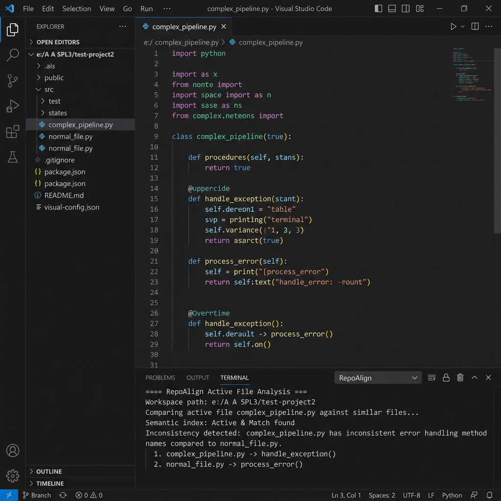
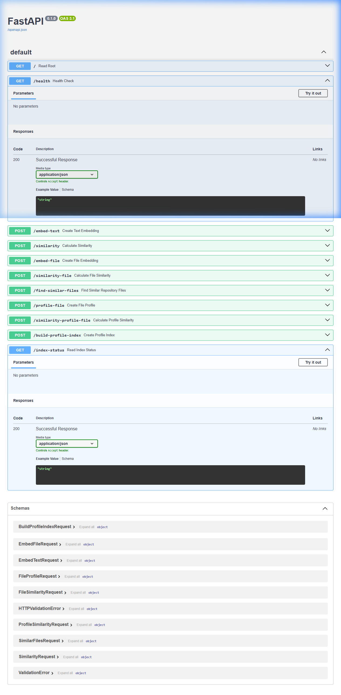

# RepoAlign: AI-Driven Repository-Level Semantic Consistency Checker

<p align="center">
  
  
  
  
  
  
</p>

**RepoAlign** is a state-of-the-art developer tool that detects and surfaces semantic inconsistencies, architectural drifts, and structural mismatches across codebases. By bridging **advanced static parsing (TypeScript AST / multi-line regex extractions)** with **deep learning representations (Sentence-Transformers)**, RepoAlign calculates multi-factor similarity metrics to ensure that modules following similar architectural roles implement consistent conventions.

---

## 📸 Visual Overview

### 🖥️ VS Code Extension in Action
Below is a screenshot of the **VS Code Extension** analyzing files in `test-project2`. It detects structural anomalies in the active workspace and reports details to the output channel:

<p align="center">
  
</p>

### 📊 Interactive FastAPI Swagger UI API Dashboard
The FastAPI backend provides an interactive documentation playground where researchers and recruiters can inspect, test, and query all semantic indexing and embedding endpoints:

<p align="center">
  
</p>

---

## 🚀 Key Features

* **Multi-Factor Hybrid Similarity Scoring**: Combines semantic embeddings (S-BERT), import dependency-graph Jaccard overlap, and class/method structural motifs.
* **Granular Static Code Profile Builder**: Parses class declarations, multiline method signatures, Angular/NestJS constructor dependency injections, and service call chains.
* **Automated File-Role Classification**: Infers the architectural role of files (e.g., component, service, module, guard, or utility helper) using decorator heuristics and filename patterns.
* **Dynamic Indexing & State Management**: Detects stale index state by tracking modification times of workspace files relative to the latest index timestamp.
* **Pre-Commit Staging Scanner**: Seamlessly hooks into git pre-commit workflows, preventing inconsistent code from being committed.

---

## 🛠️ System Architecture & Workflow

RepoAlign implements a decoupled client-server architecture:

1. **VS Code Extension (TypeScript Frontend)**:
   - Registers workspace scanners, commands, and git Hooks.
   - Monitors user files, gathers local workspace status, and triggers API endpoints.
   - Streams analysis outputs directly to the integrated `RepoAlign` output channel.
2. **FastAPI Server (Python Backend)**:
   - Loads the lightweight `all-MiniLM-L6-v2` model for high-speed sentence embeddings.
   - Runs heuristic class, signature, and dependency analyzers.
   - Stores pre-computed file profiles and embeddings in a structured JSON cache file for O(1) retrieval.

```
                  +----------------------------------+
                  |  VS Code Client (TypeScript)     |
                  +-----------------+----------------+
                                    |
                                    | HTTP REST API
                                    v
                  +-----------------+----------------+
                  |  FastAPI Backend Engine (Python) |
                  +--------+----------------+--------+
                           |                |
                Feature Extraction    Model Inference (S-BERT)
                           |                |
                           v                v
                  +--------+----------------+--------+
                  |    Semantic Profile Index (.json)|
                  +----------------------------------+
```

---

## 📁 Repository Directory Structure

```
repoalign-vscode/
├── assets/                     # Screenshots and visual media assets
├── README.md                   # Main root repository documentation
└── RepoAlign/
    └── repoalign/
        ├── package.json        # Extension manifest, commands, scripts
        ├── tsconfig.json       # TypeScript configuration
        ├── eslint.config.mjs   # ESLint code quality configuration
        ├── src/                # VS Code extension TypeScript source code
        │   ├── extension.ts    # Main extension activation file
        │   ├── commands/       # Commands (rebuild index, compare file, etc.)
        │   ├── utils/          # Utilities (Git interface, apiClient, etc.)
        │   └── cli/            # CLI and git hook runner
        └── python_engine/      # Python FastAPI backend engine
            ├── requirements.txt # Backend pip dependencies
            ├── app.py          # Server entry point importer
            └── app/
                ├── main.py     # FastAPI app instantiation and routing
                ├── routes/     # REST routes (health, similarity, index, etc.)
                └── services/   # Business logic (embedder, builder, classifier)
```

---

## 🔧 Installation & Quick Start

### 1. Prerequisites
- **Node.js**: v18.0+
- **Python**: v3.11+
- **VS Code**: v1.110.0+

### 2. Python Backend Setup
Navigate to the backend engine folder, initialize a virtual environment, install dependencies, and run:
```bash
cd RepoAlign/repoalign/python_engine

# Create virtual environment
python -m venv venv

# Activate virtual environment
# Windows:
venv\Scripts\activate
# macOS/Linux:
source venv/bin/activate

# Install dependencies
pip install -r requirements.txt

# Start the FastAPI backend
python -m uvicorn app.main:app --host 127.0.0.1 --port 8000
```
Verify the server is online at `http://127.0.0.1:8000` or browse the interactive documentation at `http://127.0.0.1:8000/docs`.

### 3. VS Code Extension Setup
In a new terminal window, navigate to the extension folder, install node dependencies, and build the extension:
```bash
cd RepoAlign/repoalign

# Install node dependencies
npm install

# Compile TypeScript code
npm run compile
```

---

## 💻 Running and Debugging the Extension

1. Open the folder `RepoAlign/repoalign` in VS Code.
2. Press **`F5`** on your keyboard.
3. A new **[Extension Development Host]** window will open.
4. In the new window, open a workspace (e.g. `test-project2`).
5. Open the Command Palette (**`Ctrl+Shift+P`** / **`Cmd+Shift+P`**), search for and run `RepoAlign: Start` to verify connection to the running FastAPI server.
6. Run `RepoAlign: Rebuild Semantic Index` to build the semantic profiles for your workspace files.
7. Run `RepoAlign: Check Repository` to execute the full consistency check.

---

## 🧬 Inside the AI Model & Scoring Algorithms

### 1. Semantic Embedding Model
RepoAlign uses the Hugging Face `all-MiniLM-L6-v2` sentence-transformer. It encodes structural profile text representation into a dense **384-dimensional vector**.
* Profile representation template:
  ```text
  File Path: {normalized_path}
  Architectural Role: {role}
  Classes Defined: {class_names}
  Methods Declared: {method_names}
  Imports: {imports}
  Injected Services: {constructor_injections}
  ```

### 2. Weighted Hybrid Similarity Scoring Formula
To provide robust consistency assessments, similarity between a query file ($Q$) and a candidate file ($C$) is computed as:

$$\text{Score}(Q, C) = 0.65 \times \text{Sim}_{\text{emb}}(Q, C) + 0.20 \times \text{Overlap}_{\text{graph}}(Q, C) + 0.15 \times \text{Overlap}_{\text{motif}}(Q, C)$$

* **$\text{Sim}_{\text{emb}}(Q, C)$**: Cosine similarity between embedding vectors:
  $$\text{CosineSimilarity}(U, V) = \frac{U \cdot V}{\|U\| \|V\|}$$
* **$\text{Overlap}_{\text{graph}}(Q, C)$**: Jaccard index of import dependency sets.
* **$\text{Overlap}_{\text{motif}}(Q, C)$**: Jaccard index of derived method signatures and class motifs.

---

## 🏆 Development & Quality Engineering
RepoAlign adheres to strict engineering guidelines:
* **Fully Typed Codebase**: Strict TypeScript config used (`tsconfig.json`).
* **Code Formatting**: Lints source files using ESLint.
* **Lint Enforcement**:
  ```bash
  npm run lint
  ```
* **Git Hook CLI integration**: Integrated CLI scripts automatically audit changes during local git operations.

---

## 📄 License
This project is licensed under the MIT License. See [LICENSE](LICENSE) for details.

*Happy coding!* 🚀
